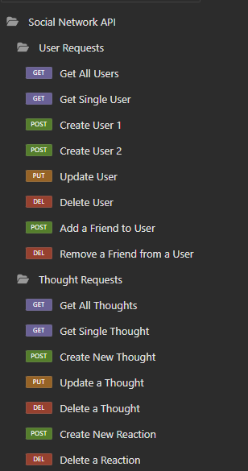

# Social Network API

## Description

This project is a showcase of how to set up routing on the backend for use with a social network. This project uses Express and Mongoose to create and manage a database of users, thoughts, and reactions. This is purely for the backend and does not contain an interactable frontend interface. Because of this, this project uitilizes Insomnia in order to send the requests for database management.

## Table of Contents

[Installation](#installation)

[Usage](#usage)

[Contributing](#contributing)

[Tests](#tests)

[License](#license)

[Questions](#questions)

## Installation

This project will require the user to direct their terminal into the project directory and run the command 'npm i' to install the dependencies. Afterwards, use node or nodemon to run server.js to start up the server for interaction. As stated in the description, Insomnia or another program capable of sending database requests will be required to manipulate the data.

## Usage

The routing in this project supports the entire suite of CRUD functions(create, read, update, and delete). You may find the specific routes below with any required information that needs to be submitted with the request:

_Please not that all these routes will begin with `/api`_

### User

`/users` - This route will be used to **GET** all users and create a new user with **POST**. When creating a new user with **POST**, please be sure to include their `username` and `email`.

`/users/{userId}` - Replace `{userId}` with the user's unique `_id` value that is created for it in Mongo. This route is used to **GET** a single user, update a user with **PUT**, and to **DELETE** a user.

`/users/{userId}/friend/{friendId}` - Replace `{userId}` and `{friendId}` with the `_id`s of the user and the associated user as a friend respectively. This route will allow you to add friend to a user with **PUT** or **DELETE** a friend from a user's friend list.

### Thoughts

`/thoughts` - This route will be used to **GET** all thoughts as well as create a new thought with **POST**. When creating a new thought with **POST**, please be sure to include `thoughtText`, the `username` of the user that created the thought, and the `userId` which can be pulled from the user's `_id` key in the Mongo database.

`/thoughts/{thoughtId}` - Replace `{thoughtId}` with the `_id` value for the specific thought in Mongo. This path supports the ability to **GET** a single thought, update a thought with **PUT**, or **DELETE** a thought from the database.

`thoughts/{thoughtId}/reactions` - Replace `{thoughtId}` with the `_id` value for the specific thought in Mongo. This path will allow you to create a reaction with **POST** and will link it to the corresponding thought.

`thoughts/{thoughtId}/reactions/{reactionId}` - Replace `{thoughtId}` with the `_id` value for the specific thought in Mongo and `{reactionId}` with the unique id held in the `reactionId` key. This path will allow you to **DELETE** a specific reaction from a thought.

## Contributing

How to contribute to this project:

Further refinement of the routes and how they can handle/share information will help turn this into a more robust backend. Any contribution towards developing a frontend for this API will also enable this app to be more user friendly.

## Tests

All the routes were tested successfully within Insomnia. Attached is a screenshot from Insomnia of all the routes that were used.

## License

The license being used for this project is MIT. Please see the license file in the GitHub repository for more information

## Questions

You may view a video demonstrating the functionality of this API by visiting this Google Drive link: https://drive.google.com/file/d/1NVYwj6K2VAFh_LdJ7NXTHpPVZWhRCNdZ/view?usp=sharing

If there are any questions, you may visit my GitHub page at
https://github.com/PeteOottamakorn

Or feel free to contact me at poottamakorn@gmail.com.
